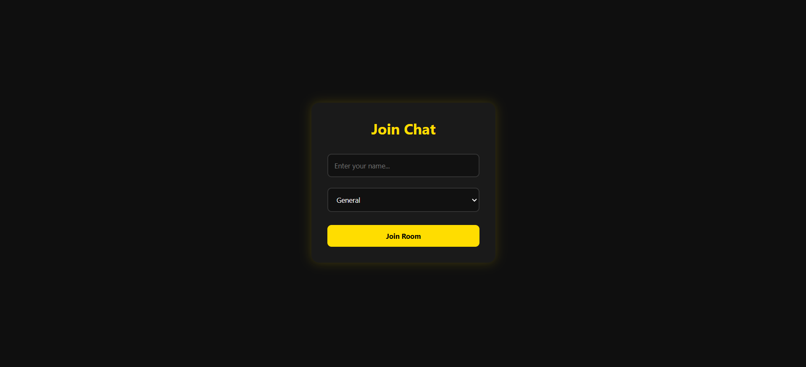

# 💬 Real-Time Chat Application

A full-stack **real-time chat application** built using modern web technologies.
This app allows users to communicate instantly with multiple users using WebSockets.

---

##  Live Demo

*  Frontend: [https://chat-app-xxxx.vercel.app](https://chat-app-ashen-rho.vercel.app/)
*  Backend: [https://chat-app-eez0.onrender.com](https://chat-app-eez0.onrender.com)

---

##  Features

*  Real-time messaging using WebSockets (Socket.io)
*  Multiple chat rooms (General / Tech)
*  User identification (Username system)
*  Typing indicator ("User is typing...")
*  Join/Leave notifications
*  Premium Black & Yellow UI design
*  Responsive design (works on mobile & desktop)

---

##  Tech Stack

### Frontend

* React (Vite)
* CSS (Custom Styling)

### Backend

* Node.js
* Express.js
* Socket.io

---

##  Project Structure

```
chat-app/
 ├── backend/
 │    ├── server.js
 │
 ├── frontend/
 │    ├── src/
 │    │    ├── components/
 │    │    │     ├── Join.jsx
 │    │    │     ├── Chat.jsx
 │    │    ├── socket.js
 │
 ├── README.md
```

---

##  Installation & Setup

###  Clone the repository

```
git clone https://github.com/your-username/chat-app.git
cd chat-app
```

---

###  Backend Setup

```
cd backend
npm install
node server.js
```

---

###  Frontend Setup

```
cd frontend
npm install
npm run dev
```

---

##  Deployment

* Backend deployed on **Render**
* Frontend deployed on **Vercel**

---

##  How to Test

1. Open the app in two browser tabs or devices
2. Enter different usernames
3. Join the same room
4. Send messages and see real-time updates

#Youtube Link
https://youtu.be/iJpwWzKFljg?si=yVH5kawepUJ0M0_t

Desktop view


